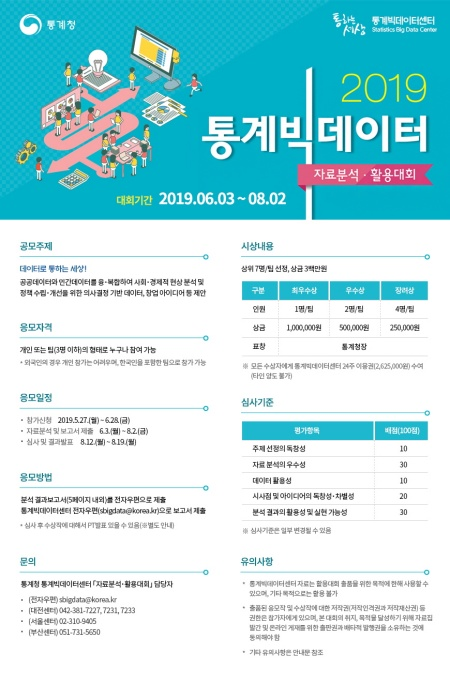

## [제 1회 통계빅데이터 분석 활용대회](https://data.kostat.go.kr/sbchome/bbs/boardList.do?boardId=SBCSBBS_000000001000&curMenuNo=OPT_03_03_00_0) :trophy:

 

* 목적
  + 정부혁신의 일환으로 통계빅데이터센터 자료 분석 기회를 제공하여 **데이터 기반의 의사결정 문화 확산** 및 **통계빅데이터센터 이용 활성화**
 
 * 주제: **데이터로 통하는 세상!**
   + 공공데이터와 민간데이터를 융·복합하여 사회·경제적 현상 분석 및 정책 의사결정 모델 발굴, 창업 아이디어 등 제안
   
 * 지원자격
   + 개인 또는 팀 (3명 이하)의 형태로 누구나 참여 가능 
   - *외국인의 경우 개인 참가는 어려우며, 한국인을 포함한 팀으로 참가 가능*
  
 * 대회기간
   + 2019.06.03(월) ~ 2019.08.02(금)
   
 * 활용데이터: 통계빅데이터센터 제공자료, 공공·민간데이터
   + 타출처의 데이터와 연계 분석 가능
   + 통계빅데이터센터 제공자료
     - 행정통계자료 (통계등록부(10종), 행정통계 (8종)), 민간자료 (SKT 빅데이터)
